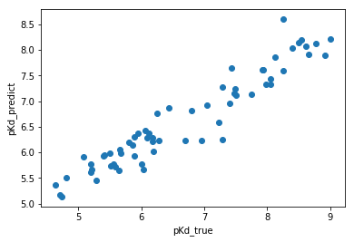
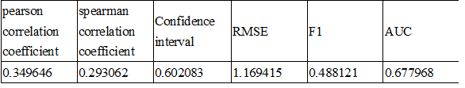

# N121's solution to IDG-DREAM Drug-Kinase Binding Prediction Challenge

Chih-Han Huang 1,2,†, Edward S. C. Shih 1, †, Tsai-Min Chen 1, †, Chih-Hsun Wu1, Wei-Quan Fang1, Jhih-Yu Chen1, and Ming-Jing Hwang 1,2,\*

1 Institute of Biomedical Sciences, Academia Sinica, Taipei, Taiwan, 2 Genome and Systems Biology Degree Program, National Taiwan University and Academia Sinica, Taipei, Taiwan
\*To whom correspondence should be addressed.
†These authors contributed equally.

## Abstract

Our model utilizes random forest for predicting the pKd by Circular Fingerprints of SMILES of drugs and inhibition data of proteins.

## Introduction

Previous studies of prediction of pKd usually used structure or sequence data of protein. However, these methods cost lots of time to predict; furthermore, some of proteins do not have structure data.
Experiments of measure pKd are hard, but to measure inhibition data of a protein and a drug is much more easier and faster.
Here, we developed novel method to predict the pKd by Circular Fingerprints of SMILES of drugs and inhibition data of proteins.

## Methods

Our model utilizes random forest for predicting the pKd by Circular Fingerprints of SMILES of drugs and inhibition data of protein˜s.

pKds , SMILES of drugs, proteins were obtained on Drug Target Commons [1]. Circular Fingerprints (Morgan Fingerprints) were achieved from SMILES of drugs by RDKit [2, 3]. Inhibition data of proteins was obtained from Jing Tang et al. and David H. Drewry et al. [1, 4].
Inhibition data of the specific protein and the specific drug and circular Fingerprint of the specific drug as feature for following training. Training set and testing set were randomly split as 70% and 30%
Random forest was used to predicting the pKd using inhibition data of the specific protein and the specific drug and circular Fingerprint of the specific drug as feature. Training set was used for building model, and testing set was used for testing the model. AUC, F1, RMSE, pearson correlation coefficient, spearman correlation coefficient were used for evaluating the model performance.

## Result

Performance of testing set was following: AUC 0.98, F1 0.92, RMSE 0.47, pearson correlation coefficient 0.95, spearman correlation coefficient 0.95.
Fig. 1 was the plot of predicted pKd and reference pKd. Table 1 was result of round 1b, and Table 2 was result of round 2.

 


Fig. 1 plot of predicted pKd and reference pKd


 

Table 1 Result of round 1b

 

Table 2 Result of round 2


## Usage of code

A.	Following is demo of constructing docker of N121 and run docker of N121


(A)	Download "data" folder (let the location be C:\idg\data)


(B)	In cmd

```
cd C:\idg\data
docker build -t  docker.synapse.org/syn18507261/n121_idg:9686281 .
docker login -u <user_ID> -p <password> docker.synapse.org
docker push docker.synapse.org/syn18507261/n121_idg:9686281
docker run -it --rm -v C:/idg/data/io:/output docker.synapse.org/syn18507261/n121_idg:9686281
```

(C)	local directory io has template.csv and after running will contain predictions.csv


## References

1.	Tang, J., et al., Drug Target Commons: a community effort to build a consensus knowledge base for drug-target interactions. Cell chemical biology, 2018. 25(2): p. 224-229. e2.
2.	G, L. RDKit: Open-source cheminformatics. . Available from: http://www.rdkit.org.
3.	Rogers, D. and M. Hahn, Extended-connectivity fingerprints. Journal of chemical information and modeling, 2010. 50(5): p. 742-754.
4.	Drewry, D.H., et al., Progress towards a public chemogenomic set for protein kinases and a call for contributions. PloS one, 2017. 12(8): p. e0181585.

## Authors Contribution Statement

Chih-Han Huang, Edward S. C. Shih, Tsai-Min Chen Ming-Jing Hwang developed the model, Chih-Hsun Wu, Wei-Quan Fang, Jhih-Yu Chen assisted the research.
