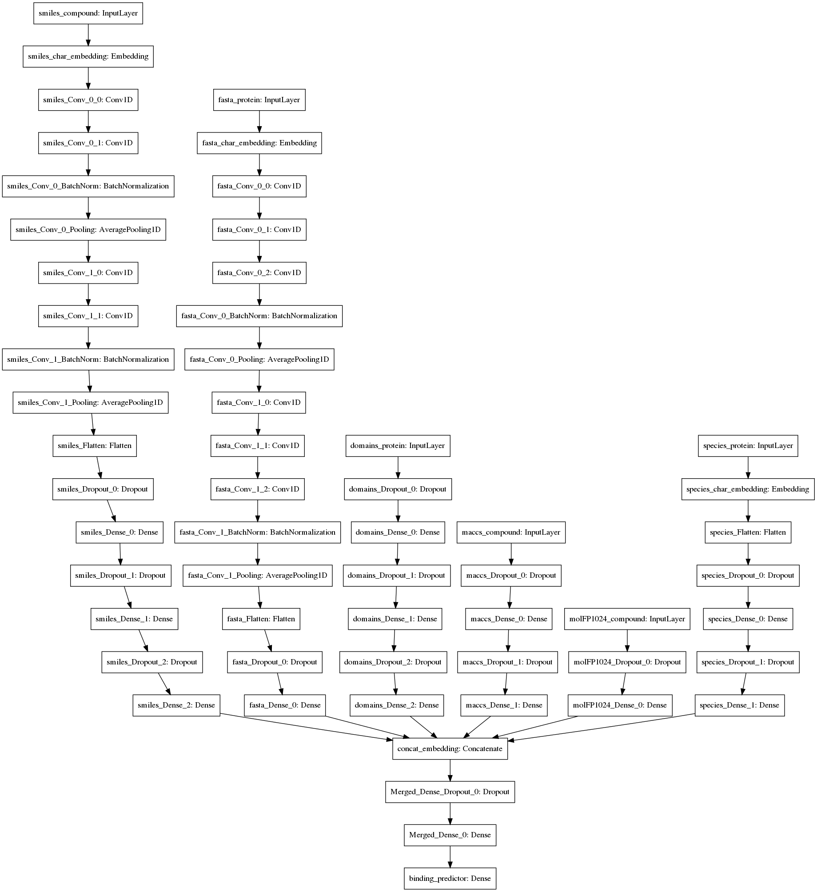
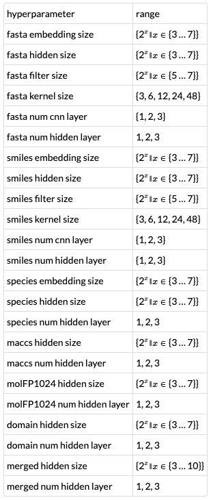

# Team MLmed: A CNN for drug kinase binding prediction
Matthias Lienhard, Paul Prasse, Ivo Bachmann, Julia Ganzlin, Gal Barel, and Ralf Herwig

## Abstract
For the drug kinase binding prediction DREAM challenge, we trained a deep convolutional neuronal network with the DTC dataset and three features for the proteins as well as three features for the chemical compounds as input. Hyperparameters (e.g. number and size of hidden layers) were determined by random search on a parameter grid.


## Training data and features
As suggested by the challenge organisers, training data was extracted from the DTC dataset (Jing Tang, Balaguru Ravikumar, Zaid Alam, Anni Rebane, Markus Vähä-Koskela, Gopal Peddinti, Arjan J van Adrichem, Janica Wakkinen, Alok Jaiswal, Ella Karjalainen, et al. Drug target commons: a community effort to build a consensus knowledge base for drug-target interactions. Cell chemical biology, 25(2):224–229, 2018). To describe the proteins, we used the protein sequence, the species, and presence of selected protein domains as features.  Features describing compounds are the canonical SMILES sequence, the MACCS 166 keys (MDL Information Systems. Maccs keys.) and a 1024 bit molecular fingerprint computed by the RDKit chemoinformatics software (Open-source cheminformatics. http://www.rdkit.org).

### Filtering and preprocessing of the DTC dataset
We selected Inchi keys and Uniprot ids as primary identifiers for the compounds and target proteins, respectively. For the DTC data, we first complemented missing Inchi keys by requesting Chembl using the compound ids. Next we filtered the data by value type for Kd and similar values (`standard_type` in ["KD","Kd","KI","Ki","pKD"]), concentration units (`standard_units` in ["NM", "MM", "UM", "M", "NMOL/L"]). We further excluded measurements on protein complexes, and requested the relation to be equal (`standard_relation` '='). Then we transformed all concentrations to pKd[M]. Mutated proteins were kept, but to avoid ambiguity of the protein id, we added the mutation descriptions to the uniprot id. Finally, we exported the relevant columns, the protein and compound id as well as the pKD[M] transformed value as tab separated text for easy import. From these dataset, we used two different subsets to train our models: a first subset *complete* containing all data points from the dataset described above and a second subset *human kinases* containing only the data points involving human kinases. Details of the used datasets can be seen in Table 1

|dataset | # instances | # unique compounds | # unique proteins |
| --- | --- | --- | ---
| complete  |  2,185,412 | 821,046 | 6,032 |
| human kinases  |  215,697  | 110,431 | 467 |

**Table 1**: Training datasets

### Kinase features
For the Proteins we considered three different features: the protein sequence, the species, and the presence of different kinase domains. We obtained the protein sequence as well as the species from a uniprot fasta file as well as web requests for proteins missing in the fasta. For mutated proteins, we altered the protein sequence according to the mutation. Then we ran InterProScan (Philip Jones, David Binns, Hsin-Yu Chang, Matthew Fraser, Weizhong Li, Craig McAnulla, Hamish McWilliam, John Maslen, Alex Mitchell, Gift Nuka, et al. Interproscan 5: genome-scale protein function classification. Bioinformatics, 30(9):1236–1240, 2014.) on the protein sequence to determine the domain structure. We selected domains related to GO:0004672 ('protein kinase activity') which were present in at least 100 proteins from the DTC dataset to be considered.

### Compound features
The three features we considered for the chemical compounds were: the SMILES sequence, the MACCS 166 keys and a 1024 bit molecular fingerprint. In order to obtain consistent features, we used the RDKit chemoinformatics software to produce and canonicalize  SMILES. The same software was used to produce the fingerprint and the MACCS keys.

## Model description
### Model architecture
We used a deep neuronal network architecture to predict the target value. For the protein sequences as well as the SMILES we used one to three convolutional layers, followed by one to three dense hidden layers. The remaining features, e.g. the protein domains and the species corresponding to the proteins, as well as the MACCS keys and 1024 bit molecular fingerprint for the compounds, were modelled by one to three dense layers. The output of all 6 feature networks were concatenated and integrated by one to three hidden layers, resulting in a single output node representing the target value. The overall network is shown in Figure 1. Our model framework is implemented in Python, based on  Keras (François Chollet et al. Keras. https://keras.io, 2015.)  and Tensorflow (Martín Abadi, Ashish Agarwal, Paul Barham, Eugene Brevdo, Zhifeng Chen, Craig Citro, Greg S. Corrado, Andy Davis, Jeffrey Dean, Matthieu Devin, Sanjay Ghemawat, Ian Goodfellow, Andrew Harp, Geoffrey Irving, Michael Isard, Yangqing Jia, Rafal Jozefowicz, Lukasz Kaiser, Manjunath Kudlur, Josh Levenberg, Dandelion Mané, Rajat Monga, Sherry Moore, Derek Murray, Chris Olah, Mike Schuster, Jonathon Shlens, Benoit Steiner, Ilya Sutskever, Kunal Talwar, Paul Tucker, Vincent Vanhoucke, Vijay Vasudevan, Fernanda Viégas, Oriol Vinyals, Pete Warden, Martin Wattenberg, Martin Wicke, Yuan Yu, and Xiaoqiang Zheng. TensorFlow: Large-scale machine learning on heterogeneous systems, 2015. Software available from tensorflow.org.) libraries as well as the scikit-learn (F. Pedregosa, G. Varoquaux, A. Gramfort, V. Michel, B. Thirion, O. Grisel, M. Blondel, P. Prettenhofer, R. Weiss, V. Dubourg, J. Vanderplas, A. Passos, D. Cournapeau, M. Brucher, M. Perrot, and E. Duchesnay. Scikit-learn: Machine learning in Python. Journal of Machine Learning Research, 12:2825–2830, 2011.) machine learning package. We trained the networks on a single server with a 40-core Intel(R) Xeon(R) CPU E5-2640 processor, 128 GB of memory and GeForce GTX TITAN X GPU using the NVidia CUDA platform.



**Figure 1**:  Final network architecture

### Hyperparameter fitting
To find the best working parameters for our CNN we performed a random search on the paramter grid shown in Table 2.  To score our models we performed a test on a hold-out-dataset containing a small proportion of compounds not present in the training data. For the round 2 submission we selected the best performing model trained on the *human kinases* dataset as well as the best model trained on the *complete* dataset (see Table 1)



**Table 2**: Range for hyperparameters

## Prediction using Docker
To create the predictions of submission with objectId $9686208$ run:

```
docker run -v ${PWD}/io/:/input/ -v ${PWD}/io/:/output/ docker.synapse.org/syn18502700/ml-med:9686208
```
To create the predictions of submission with objectId $9686266$ run:

```
docker run -v ${PWD}/io/:/input/ -v ${PWD}/io/:/output/ docker.synapse.org/syn18502700/ml-med:9686266
```

## Experimental Results
On held out validation data from DTC the models are able to predict the target value and reaching a RMSE under 0.8, and $\varnothing$ AUC over 0.9 (Table 3). These results stand in marked contrast to the performance of our submissions.

|train data | validation data | RMSE | pearson | spearman | f1 |  avg AUC |
|---|---|---|---|---|---|---|
|*complete*| *complete* | 0.76 | 0.84 |0.8 | 0.74 | 0.94
|*complete*| *human kinases* | 0.85 | 0.77 |0.76 | 0.71 | 0.89
|*complete*| *round 2* | 1.19 |  | 0.353 | | 0.696
|*human kinases* | *complete* | 1.34 | 0.35   |0.3 | 0.29 | 0.78
|*human kinases* | *human kinases* | 0.74 | 0.84 | 0.83 | 0.78 | 0.92
|*human kinases* | *round 2* | 1.154 | | 0.213 |  | 0.618 |

**Table 3**: Validation results for best models trained on *complete*and *human kinases*datasets.

## Conclusions
Provided the performance on the held out validation data, we are disappointed by the outcome on the challenge dataset. Due to the restrictive challenge rules only allowing for a very limited number of submissions and obscuring the metrics, we were unable to find the cause of this difference in performance.  We hope for insight from the solutions of the other teams and from feedback during the community phase of the challenge.

## Authors' Contributions
M.L. and P.P. developed, implemented, and trained the model. I.B., J.G., and G.B. created features. R.H. supervised the project.
